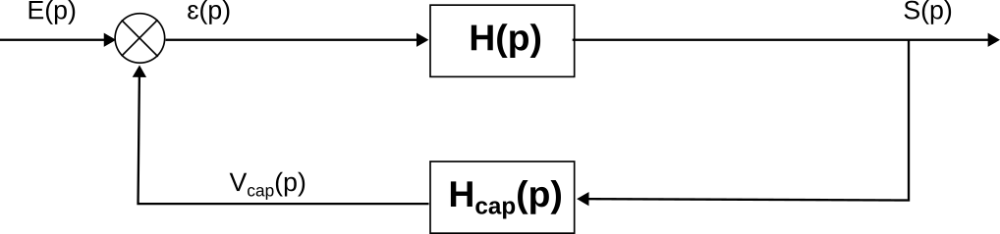
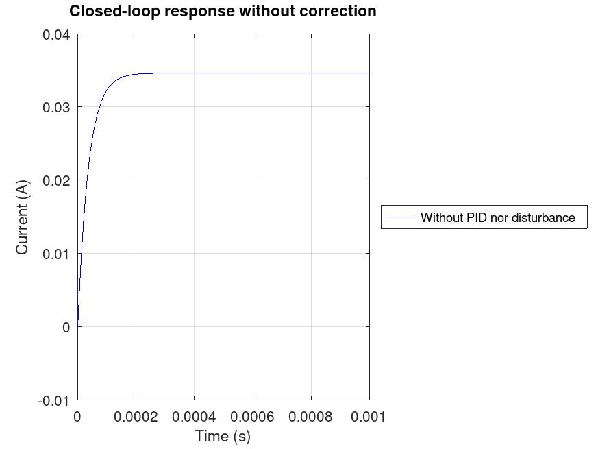
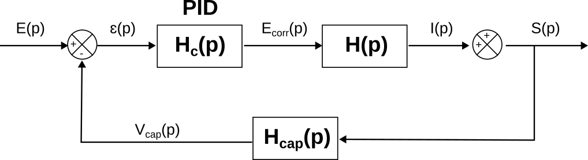
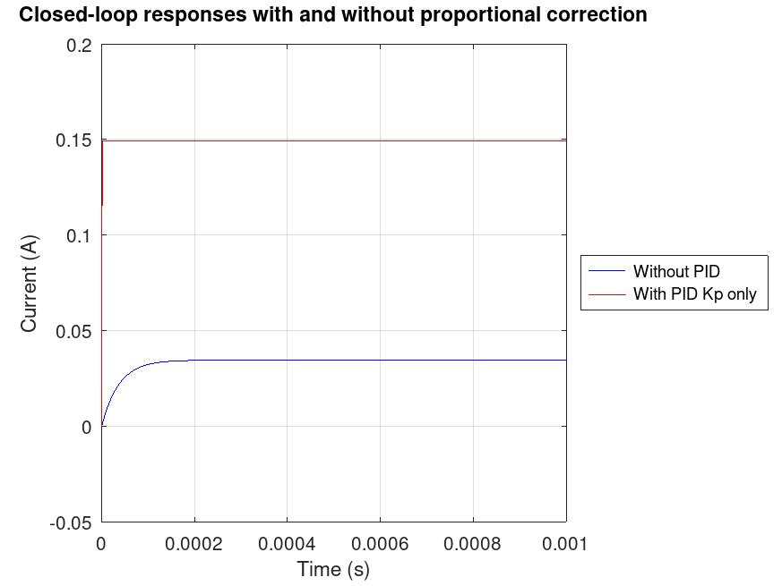
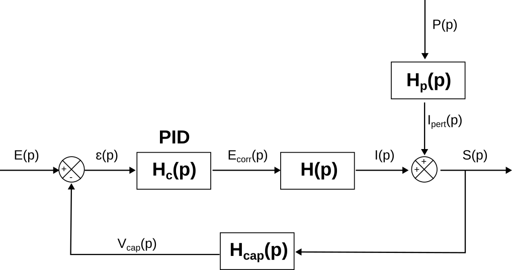
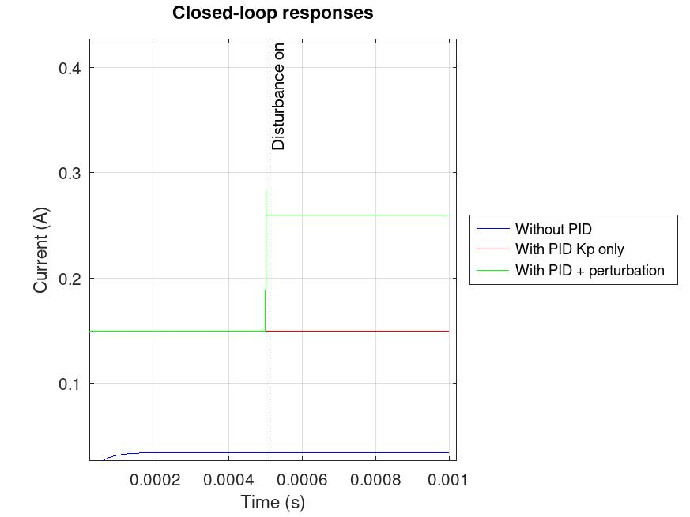
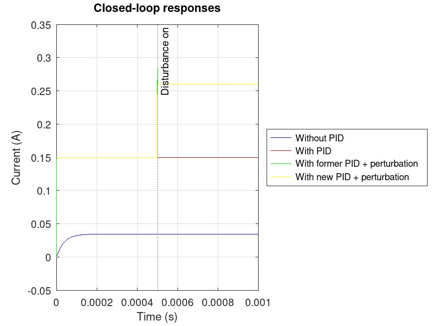
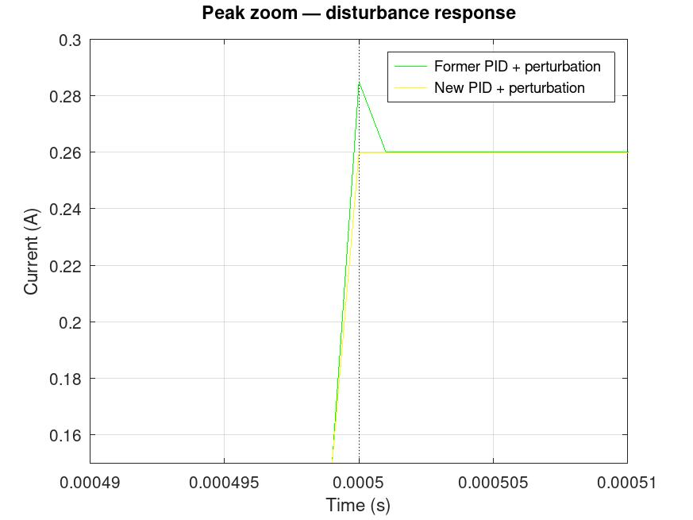
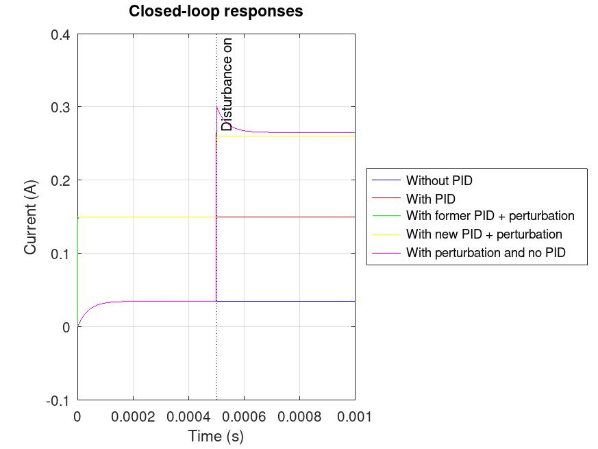

# Démarche de détermination des paramètres du correcteur PID asservissant le système préhenseur

<br> <br> 
Ce document a pour objectif de présenter la représentation du système de préhension sous l'angle de l'automatique, afin de pouvoir l'asservir avec un régulateur Proportionnel Intégral Dérivé (PID). Les paramètres de ce correcteur seront calibrés à l'aide d'une simulation sur Octave (alternative open-source et gratuite de Matlab - code compatible).

<br> 

## Table des matières

[Démarche de détermination des paramètres du correcteur PID asservissant le système préhenseur](#démarche-de-détermination-des-paramètres-du-correcteur-pid-asservissant-le-système-préhenseur) <br>
[Modélisation du système par sa fonction de transfert](#modélisation-du-système-par-sa-fonction-de-transfert)<br>
  [Constantes du systèmes](#constantes-du-systèmes)<br>
  [Equations liées au moteur de préhension](#équations-liées-au-moteur-de-préhension)<br>
  [Passage dans le domaine de Laplace et obtention de la fonction de transfert du MCC](#passage-dans-le-domaine-de-laplace-et-obtention-de-la-fonction-de-transfert-du-mcc)<br>
[Modélisation sur Octave/Matlab et implémentation d'un correcteur PID](#modélisation-sur-octavematlab-et-implémentation-dun-correcteur-pid)<br>
[Implémentation du PID sur Arduino MEGA](#implémentation-du-pid-sur-arduino-mega)<br>
[Correction ... de la correction](#correction---de-la-correction)<br>
[Annexes](#annexes)<br>
  [Annexe : Liens utiles](#annexe-liens-utiles)<br>
    [Données du moteur](#données-du-moteur)<br>
    [Calibrage du PID](#calibrage-du-pid)<br>
    [Ressources Octaves et outils](#ressources-octaves-et-outils)<br>
    [Arduino](#arduino)<br>
  [Annexe : code Matlab/Octave commenté](#annexe-code-matlaboctave-commenté)<br>


## Modélisation du système par sa fonction de transfert

### Constantes du systèmes

En utilisant la datasheet fournie par Mr Voyer, on peut isoler les grandeurs suivantes : 

- A vide :
    - $U=5$ V
    - $I=0,15$ A
    - $N=195$ tr/min
    
- Bloqué :
    - $U<1$ V
    - $I=0,26$ A

- $R = 3,8$ $\Omega$, résistance de bobinage
- $k = 4,5 \times 10^{-3}$ $V\cdot rad^{-1} \cdot s$
- $L = 1,6 mH$
- $f = 2,1 \cdot 10^{-7} N\cdot m \cdot rad^{-1} \cdot s$


### Equations liées au moteur de préhension

Afin de pouvoir asservir le moteur préhenseur (Moteur à Courant Continu, MCC), il est nécessaire d'obtenir une modélisation mathématique de ce dernier, basé sur son comportement physique (basé sur des lois physiques).

Le MCC peut être défini par les équations électrique et mécanique suivantes : 

- équation électrique : $u(t) = Ri(t) + L \frac{di}{dt} + e(t)$, <br>
où u(t) est la tension aux bornes du moteur, R sa résistance interne, i l'intensité qu'il consomme, L son inductance interne et e(t) sa forme électro-motrice (FEM). <br><br>
- équation mécanique : $J\frac{d\omega(t)}{dt}+f\times\omega(t)=Cm   (2)$ <br>
où J est le moment d'inertie du moteur, $\omega$ sa vitesse de rotation, f son coefficient de frottement et Cm son couple moteur. <br><br>
- relation couple-intensité : $Cm = k\times i(t)   (3)$, où k est la constante interne du moteur. <br><br>
- relation FEM-vitesse de rotation : $e(t)= k\times\omega(t)   (4)$<br><br>

En injectant les formules 3 et 4 dans les formules 1 et 2 : 

- $u(t) = Ri(t) + L \frac{di}{dt} + k\times\omega(t)$ <br>
- $J\frac{d\omega(t)}{dt}+f\times\omega(t)=Cm   (2)$ <br> <br>

### Passage dans le domaine de Laplace et obtention de la fonction de transfert du MCC

On passe les équations précédentes dans le domaine de Laplace :

- $U(p) = RI(p)+LpI(p)+k\Omega(p)$
- $Jp\Omega(p)+k\Omega(p)=Cm$

$\Leftrightarrow$ 

- $U(p) = RI(p)+LpI(p)+k\Omega(p)$
- $\Omega(p)=\frac{Cm}{Jp+f} = \frac{kI(p)}{Jp+f}$

$\Leftrightarrow$ 

- $U(p) = RI(p) + LpI(p) + k(\frac{k}{Jp+f})I(P)$ <br> <br> $= (R+Lp+\frac{k²}{Jp+f})I(p)$

$\Leftrightarrow$

- $\frac{I(p)}{U(p)} = \frac{1}{R+Lp+\frac{k²}{Jp+f}} = H(p)$ <br> <br> 

On ne possède pas la valeur de $J$, on néglige donc cette valeur : la fonction de transfert sera purement électrique. <br>
On met cette nouvelle version sous forme canonique : <br><br>

$H(p)=\frac{1}{Lp+(R+\frac{k²}{f})}$ <br> <br> $= \frac{\frac{1}{R+\frac{k²}{f}}}{1+\frac{L}{R+\frac{k²}{f}}p}$

<br> <br>

### Déterminations du gain statique et du temps caractéristique
<br> 
Nous commençons l'application numérique en redéterminant la valeur de $f$, définie précédemment en prendant en compte $J$, que l'on n'a pas.

En négligeant J, on se retrouve avec $Cm = \frac{ki(t)}{f} \Leftrightarrow f = \frac{ki(t)}{Cm}$ <br>
On sait qu'on atteint l'état final du système pour $p = 0$. <br>
On connait $I(tf) = 0,15$ A et $u(tf) = 5$ V. $\Rightarrow H(tf) = H(0) = \frac{0,15}{5} = \frac{1}{R+\frac{k²}{f}}$ <br><br>

$\Rightarrow (\frac{5}{0,15}-R)f = k²$ <br>

$\Leftrightarrow f = \frac{k²}{33,3-R} = 6,86\cdot 10^{-7} N\cdot m\cdot rad^{-1} \cdot s$ <br><br><br>

$\rightarrow$ gain statique : $K = \frac{1}{R+\frac{k²}{f}} = \frac{1}{3,8+\frac{(4,5\cdot 10^{-3})²}{6,86\cdot 10^{-7}}} = \frac{1}{3,8+29,52} = 0,03$ <br><br>

$\rightarrow$ temps caractéristique : $\tau = L\cdot K \Rightarrow\frac{L}{R+\frac{k²}{f}} = 1,6 \cdot 10^{-3} \cdot 0,03 = 4,8 \cdot 10^{-5} s$ <br><br>

## Modélisation sur Octave/Matlab et implémentation d'un correcteur PID

*Pour plus de détails, se fier au code .m en annexe*

On utilise les valeurs précédentes pour définir la fonction de transfert du MCC; le système est simplement composé du moteur et d'une boucle de retour, incluant une résistance qui convertit le courant de sortie en tension de retour.

<br> 

<br>

On voit que le système est très rapide, en accord avec notre faible temps caractéristique, mais la valeur finale est très base : le PID devra l'augmenter pour qu'elle atteigne 0,15 A (on teste le moteur à vide).

<br> 

<br> 

On ajoute ainsi un PID au système : 

<br> 

<br>

On définit ainsi les coefficient du PID : 

- $Kp =   1000$
- $Ki = 0$
- $Kd = 0$

Le but est uniquement d'amplifier la consigne : seul le coefficient proportionnel est nécessaire à ce stade. <br>
$Kp$ a été défini empiriquement, après plusieurs tests pour maximiser la précision (voir courbe ci-dessous).

<br> 

<br> 


On ajoute maintenant une perturbation. Cette perturbation bloque complétement le moteur : on prend $Iperturbation = Ibloqué = 0.26 A$

<br> 

<br>

En reprenant les paramètres du PID précédent, on obtient la courbe suivante : 

<br> 

<br> 

On constate l'apparition d'un pic au niveau de l'insertion de la perturbation : le premier PID doit être rectifié. La valeur finale étant juste et la perturbation étant constante, on va travailler sur le paramètre dérivé $Kd$.

On redéfinit les coefficient du PID : 

- $Kp = 1000$
- $Ki = 0$
- $Kd = 0.08$

$Kd$ a là aussi été définit par essais successifs. L'objectif a été de complétement résorber le pic, de façon à ce que le courant ne dépasse jamais l'intensité à l'état bloqué (on ne veut pas endommager le MCC). On obtient les courbes suivantes : 

<br> 


<br> 

On voit que le pic a été complétement résorbé : la correction est fonctionnelle.
A titre de comparaison, voici à quoi ressemblerait le comportement du système sans PID : on voit que la perturbation n'est pas du tout absorbé, le courant ne peut pas être fourni par le moteur.

<br> 

<br> 

## Implémentation du PID sur Arduino MEGA

Après quelques recherches, nous avons trouvé une bibliothèque de régulation par correcteur PID : **AutoPID**. Cet outil s'applique au travers d'une unique fonction : 
<br>
```c++
AutoPID(double *input, double *setpoint, double *output, 
  double outputMin, double outputMax, 
  double Kp, double Ki, double Kd)
```
<br>
où : 
<br><br>

- `*input` est le pointeur lié à la valeur retournée par l'ADC. Paramètre d'entrée (valeur intégrée dans le calcul).
- `*setpoint` est le pointeur lié à la consigne. Paramètre d'entrée.
- `*output` est le pointeur lié à la sortie du PID (compris entre la sortie minimale et la sortie maximale). Paramètre de sortie (valeur du pointeur modifiée par la fonction)
- `*outputMin` est le pointeur conditionnant la valeur minimale de la sortie.
- `*outputMax` est le pointeur conditionnant la valeur maximal de la sortie.
- `Kp` le coefficient proportionnel
- `Ki` le coefficient dérivé
- `Kp` le coefficient intégral

<br>

Les valeurs d'entrée du PID (`input` et `setpoint`) sont en volts (convertis du PWM 10 bits et du courant de consigne respectivement). La sortie et ses seuils minimaux et maximaux sont définis selon le PWM 8 bits, étant donné qu'il s'agit de la résolution du pont en H controllant le MCC (min : 0; max : 255);
<br>

On a justement un problème à ce niveau. Notre Kp étant très élevé, il suffit d'une très faible erreur ($setpoint - input$) pour que la valeur de sortie soit très grande (le coefficient proportionnel multipliant ce coefficient par l'erreur). On obtient au final une régulation très nerveuse, qui régule à peine le moteur et le fait pratiquement fonctionner en tout-ou-rien, ce qui ne va pas (soit 0, soit proche de 255).

## Correction ... de la correction

On utilise le programme Octave défini précédemment; on modifie le coefficient proportionnel de façon à ce que la précision du système ne soit pas mauvaise, tout en garantissant un facteur de multiplication suffisamment faible pour qu'il n'amplifie pas l'erreur au point de rendre le signal PWM saturé. On choisira ainsi : 
<br>
- $Kp = 1000$
- $Ki = 0$
- $Kd = 0.08$


## Annexes

### Annexe : Liens utiles

#### Données du moteur
- Documentation moteur Jaune, *Damien Voyer*, EIGSI

#### Calibrage du PID
- Cours d'Automatique Parties 1 et 2, *Jing Yun ZHAO*, EIGSI
- Guide complet pour réglage PID : <br>https://yutec.fr/freelance/reglage-pid/ <br>
- Example de modélisation PID sur Matlab : <br>https://www.youtube.com/watch?v=lfMMPe7s9nU <br>

#### Ressources Octaves et outils
- Description instruction **pid()** : <br>https://octave.sourceforge.io/control/function/pid.html <br>
- Description instruction **tf()** : <br>https://octave.sourceforge.io/control/function/tf.html <br>
- Telechargement paquet **Control** Octave : <br>https://gnu-octave.github.io/packages/control/ <br>
- Commandes pour installer des paquets sur Octave : <br>https://deepwiki.com/gnu-octave/octave/6-package-management#installing-packages <br>

#### Arduino

- Documentation officielle bibliothèque Arduino **AutoPID** : <br>https://ryand.io/AutoPID/#basic-temperature-control <br> 


### Annexe : code Matlab/Octave commenté

```matlab


  clear all %retire les variables de la mémoire
  clc %vide la console


  pkg load control %charge le paquet Octave permettant d'utiliser des outils d'asservissement (eg tf)
  %constantes
  Rmotor = 3.8 %résistance du moteur
  k = 4.5e-3%constante du moteur
  Rcap = 10 %resistance utilisée pour convertir Iout en tension de retour qu'on peut ensuite traiter
  f=6.86e-7 %coefficient de friction
  L = 1.6e-3 %inductance interne du moteur
  Ufreeload = 1.5 %tension d'entrée/de commande = Iout/Rcap quand aucune charge n'est appliquée au moteur
  Ublocked = 2.6 %tension de commande lorsque le moteur est bloqué ($\Omega nul, $Cm$ maximal$).


  %numérateur et dénominateur de la fonction de transfert
  num = [0.03]
  denum = [4.8e-5 1]
  %% vecteur de temps — en colonne pour être compatible avec lsim (le ')
  t = (0:1e-6:0.001)';  % pas de 100 µs, assez petit pour tau = 48 µs --> temps de simulation
  inputRef  = Ufreeload*ones(length(t), 1); %échelon d'entrée = 1*tensionMax


  %créaction de la Fonction de Transfert (U=5V)
  Hp = tf(num, denum)
  %resistance de la boucle de retour
  Hcap = tf(Rcap, 1); %[Rcap] fonctionne aussi , mais mieux de la définir en tant que FT


  %boucle fermée sans PID
  CLnoPID = feedback(Hp, Hcap)
  outputNoPIDNoDisturb = lsim(CLnoPID, inputRef, t);
  %{
  figure(1); step(CLnoPID); hold on;
  title('Closed-loop response without PID');
  %}


  figure(1); clf;
  plot(t, outputNoPIDNoDisturb,'b');  hold on;
  grid on;
  xlabel('Time (s)'); ylabel('Current (A)');
  title('Closed-loop response without correction');
  legend('Without PID nor disturbance','Location', 'eastoutside');


  %Evolution très rapide --> modèle électrique uniquement (on n'a pas J)
  %courant très faible : Hcap crée un retour très élevé comparé à l'entrée


  %création du PID
  Kp = 1000%coefficient proportionnel --> on veut I=U*Hc*Hp=0.15 à tf --> Hc*Hp =0.15/5=0.03
  Ki = 0%coefficient intégral
  Kd = 0%coefficient dérivé
  %seul un grand gain propotionnel est intéressant (1er ordre : pas de pic à gérer) --> changera quand on aura des perturbations
  %un grand Ki peut aussi faire l'affaire, mais on a un pic au dessus de la commande pour Ki = 50000


  Hc = pid(Kp, Ki, Kd)
  ClwithPIDNoDisturb = feedback(Hp*Hc, Hcap)
  outputWithPIDNoDisturb = lsim(ClwithPIDNoDisturb, inputRef, t);

  %{
  step(ClwithPID, 'Color', 'r'); hold on;
  legend('Without PID', 'With PID, Kp only');


  figure(2); step(ClwithPID); grid on;
  title('Closed-loop response with PID Kp only');
  %}

  figure(2); %clf;
  plot(t, outputNoPIDNoDisturb, 'b');  hold on;
  plot(t, outputWithPIDNoDisturb, 'r');
  grid on;
  xlabel('Time (s)'); ylabel('Current (A)');
  title('Closed-loop responses with and without proportional correction');
  legend('Without PID', 'With PID Kp only', 'Location', 'eastoutside');


  %on ajoute une perturbation
  Cblocked = 1.2e-3 %couple délivré par le moteur quand bloqué : couple résistant
  Iblocked = Cblocked/k
  delayBlocked = 0.0005 %0,5 ms après le début de la simulation, le moteur est bloqué
  Ublocked = 2.6 %commande en tension quand oméga est nul --> = 0.26 A * 10 ohms
  inputRef(t >= delayBlocked) = Ublocked; %si la condition est respectée (bon index) = UcommandWhenBlocked


  % simule la perturbation comme un échelon avec délai
  disturbance = zeros(length(t), 1); %vecteur de taille t et de valeur 0, doit être vertical
  disturbance(t >= delayBlocked) = Iblocked; %si la condition est respectée (bon index) = Iblocked


  %création de la fonction de transfert du courant lié à la perturbation (FT) --> boucle de retour --> voir schéma
  Hdisturb = feedback(tf(1,[1]), Hp*Hc*Hcap) %on ne peut pas faire de retour sans 2 FT --> la première est juste 1 cependant


  %génération de sorties
  %recalcul de la sortie avec changement de commande --> inputRef changé
  outputWithPIDDisturbCommand = lsim(ClwithPIDNoDisturb, inputRef, t);
  disturbToAdd = lsim(Hdisturb, disturbance, t) %perturbation à ajouter à sortie avant le retour

  ClwithPIDAndPerturbation = outputWithPIDDisturbCommand+disturbToAdd; %on additionne les 2 pour avoir la réponse

  %{
  figure(1), plot(t, ClwithPIDAndPerturbation, 'g'); grid on; hold on;
  legend('Without PID', 'With PID, Kp only','With PID and perturbation, Kp only');
  %}


  figure(3); clf;
  plot(t, outputNoPIDNoDisturb, 'b');  hold on;
  plot(t, outputWithPIDNoDisturb, 'r');
  plot(t, ClwithPIDAndPerturbation,'g');
  xline(delayBlocked, ':k', 'Disturbance on');
  grid on;
  xlabel('Time (s)'); ylabel('Current (A)');
  title('Closed-loop responses');
  legend('Without PID', 'With PID Kp only', 'With PID + perturbation', 'Location', 'eastoutside');


%on a un pic de courant supérieur à celui mentionné dans la datasheet (un petit pic toutefois) : on doit changer les valeurs du PID

 Kp=1000 %pas besoin de changer--> bonne valeur finale
 Ki=0 %on suppose que le couple résistant est constant : pas de variation de perturbation
 Kd=0.08 %Kd réduit le pic de courant, mais une valeur trop grande fait baisser la précision


 Hc = pid(Kp, Ki, Kd)
 ClwithPID = feedback(Hp*Hc, Hcap)
 outputWithNewPIDDisturbCommand = lsim(ClwithPID, inputRef, t);


 disturbance = zeros(length(t), 1); %vecteur de taille t et de valeur 0, doit être vertical
 disturbance(t >= delayBlocked) = Iblocked; %si la condition est respectée (bon index) = Iblocked

 Hdisturb = feedback(tf(1,[1]), Hp*Hc*Hcap) %on ne peut pas faire de retour sans 2 FT --> la première est juste 1 cependant


 disturbToAdd = lsim(Hdisturb, disturbance, t) %perturbation à ajouter à la sortie avant le retour

 ClwithNewPIDAndPerturbation = outputWithNewPIDDisturbCommand+disturbToAdd;

 figure(4); clf;
  plot(t, outputNoPIDNoDisturb, 'b');  hold on;
  plot(t, outputWithPIDNoDisturb, 'r');
  plot(t, ClwithPIDAndPerturbation,'g');
  plot(t, ClwithNewPIDAndPerturbation,'y');
  xline(delayBlocked, ':k', 'Disturbance on');
  grid on;
  xlabel('Time (s)'); ylabel('Current (A)');
  title('Closed-loop responses');
  legend('Without PID', 'With PID', 'With former PID + perturbation', 'With new PID + perturbation', 'Location', 'eastoutside');

  %pour se concentrer sur le pic de courant
  figure(5); clf;
  plot(t, ClwithPIDAndPerturbation,    'g'); hold on;
  plot(t, ClwithNewPIDAndPerturbation, 'y');
  xline(delayBlocked, ':k', 'Disturbance on');
  grid on;
  xlabel('Time (s)'); ylabel('Current (A)');
  title('Peak zoom — disturbance response');
  legend('Former PID + perturbation', 'New PID + perturbation');

  % fenêtre zoomée : centrée sur delayBlocked, ±10% du temps total sur x
  % portée sur y : juste au dessus de 0.26A pour voir le pic
  xlim([delayBlocked - 0.01e-3   delayBlocked + 0.01e-3]);
  ylim([0.15   0.30]);   % affiche pour des ordonnées entre 0.15 et 0.30


 %On crée un modèle avec perturbation et sans correction pour voir les effets sur le PID


 disturbance = zeros(length(t), 1); 
 disturbance(t >= delayBlocked) = Iblocked;

 Hdisturb = feedback(tf(1,[1]), Hp*Hcap) 

 outputNoPIDWithDisturb = lsim(CLnoPID, inputRef, t);
 disturbToAdd = lsim(Hdisturb, disturbance, t) 

 ClnoPIDAndPerturbation = outputNoPIDWithDisturb+disturbToAdd;

 figure(6); clf;
  plot(t, outputNoPIDNoDisturb, 'b');  hold on;
  plot(t, outputWithPIDNoDisturb, 'r');
  plot(t, ClwithPIDAndPerturbation,'g');
  plot(t, ClwithNewPIDAndPerturbation,'y');
  plot(t, ClnoPIDAndPerturbation,'m'); %color magenta
  xline(delayBlocked, ':k', 'Disturbance on');
  grid on;
  xlabel('Time (s)'); ylabel('Current (A)');
  title('Closed-loop responses');
  legend('Without PID', 'With PID', 'With former PID + perturbation', 'With new PID + perturbation' , 'With perturbation and no PID','Location', 'eastoutside');


```
